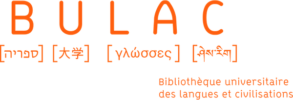
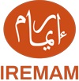
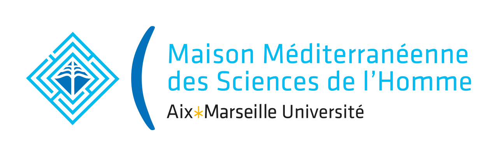
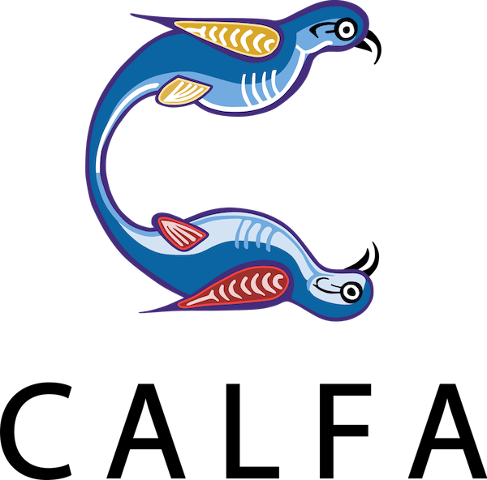

# TariMa dataset
Ground-truth of the TariMa project (HTR/OCR of Maghrebi Arabic documents).

The dataset has been collated within the frame of the [TariMa project](https://www.collexpersee.eu/projet/tarima/) (Tarih al-Maghrib. Writing History in the Maghreb in the modern and contemporary era), sponsored by the French agency [Collex-Persee](https://www.collexpersee.eu) and supervised by Antoine Perrier (CNRS).

The project combines the development of character recognition models for manuscripts (HTR) and prints (OCR) of Maghrebi Arabic texts and the scientific study of collections of Maghrebi works held in French libraries ([BULAC](https://www.bulac.fr), project manager, [College de France](https://www.college-de-france.fr) and [Bibliothèque nationale universitaire de Strasbourg](https://www.bnu.fr/fr)).
It aims to make available the digitization of a set of primary sources (in image and text format) that have been rarely used until now. Online accessibility will promote the use of Arabic sources, which are at the heart of recent shifts in the historiography of the Maghreb.

The selected corpus is composed of manuscripts and printed texts of the historical genre in a broad sens (chronicles, travelogues, biographical dictionaries, universal history, genealogy, autobiography...) Historians using Arabic manuscripts had neglected the study of this genre, in comparison with religious sciences or linguistics. 

## Dataset composition

The [RASAM dataset](https://github.com/calfa-co/rasam-dataset) already provides a strong baseline for the recognition of Arabic Maghrebi scripts. This new dataset is focused on specific contents or vocabulary lacking in previous RASAM models.

It contains 120 images, for a total of:

* 144 TextRegions
* 2.673 TextLines (2.364 transcribed)
* 27.583 words (11.307 unique)
* 146.667 characters

The TariMa dataset comprises different image resolution and size (width from 982px to 8049px), different layouts (double page, multiple columns), state of conservation, and also mixes microfilms and scans. It presents a very wide variety representative of the Maghrebi Arabic production.

<figure>
    
    <figcaption>ms. Arabe 7214 (BnF, p. 17), MS.ARA.427 (BULAC, p. 36), MS.11 (MMSH, p. 117), and lithography RES.MON.8.7199 (BULAC, p. 118)</figcaption>
</figure>

See the **Ground-truth specifications** section for details.

## Images
BULAC and BnF Images are available through the libraries' IIIF server. For the list of IDs (images and documents), see the `list-images.tsv` file. To request an image, please use the following URL template:

### BULAC library (BINA)
```
https://bina.bulac.fr/iiif/2/{image_ID}/{region}/{size}/{rotation}/{quality}.{format}
```

### Bibliothèque nationale de France
```
https://gallica.bnf.fr/iiif/ark:/12148/{document_ID}/f{image_ID}/{region}/{size}/{rotation}/{quality}.{format}
```

### Maison Méditerranéenne des Sciences de l'Homme
To download images from the MMSH, please consider a direct downloading from the the MMSH website or from archive.org (links provided in the `list-images.tsv` file).

## Ground-truth specifications

### Informations levels

Transcriptions follow guidelines defined for the [RASAM dataset](https://github.com/calfa-co/rasam-dataset). A complete description of guidelines can be found in the paper [RASAM – A Dataset for the Recognition and Analysis of Scripts in Arabic Maghrebi](https://doi.org/10.1007/978-3-030-86198-8_19).

We provide for each image a pageXML file containing three level of information:
* TextRegion localisation, with a semantic tag (e.g. `MainZone` or `TitlePageZone`), following the [SegmOnto ontology](https://github.com/SegmOnto/Guidelines);
* Baseline localisation and surrounding polygon of the line;
* Text.

```xml
<TextRegion id="r_a-1" custom="structure {type:MainZone;}">
      <Coords points="175,65 159,647 181,1109 863,1127 881,70 175,65"/>
      <TextLine id="l_a-1">
        <Coords points="208,76 225,84 257,75 309,83 352,78 423,79 478,79 534,86 655,79 708,80 767,86 789,87 820,91 850,93 850,120 824,122 802,115 791,125 753,119 729,127 686,115 583,120 524,111 482,126 466,117 421,122 370,121 354,112 335,120 293,119 267,128 235,129 231,111 217,115 197,113 208,76"/>
        <Baseline points="206,106 481,105 762,113 846,112"/>
        <TextEquiv>
          <Unicode>فلما اقسمت عليه قال لها الله احق بالطاعة منك ثم قبض القبضة كما امره الله تعلى واتى بها</Unicode>
        </TextEquiv>
      </TextLine>
```

Annotations have been made on the [Calfa Vision platform](https://vision.calfa.fr), a free web-based annotation tool for documents and images designed for Oriental scripts.

The transcription is faithful to the text present in the image, including when the word is misspelled, and does not keep the vocalization.

### Limits

This dataset is a working dataset intended to strengthen HTR models within the TariMa project and is not designed to be a generic dataset for Arabic document processing. It should be used in association with the RASAM dataset. Only the main text has been transcribed, as this is the primary objective of the project, and some pages don't include transcription (they are used for layout evaluation purposes only).

## Models availability

As part of our commitment to open science, layout analysis models produced during the TariMa project can be freely used on the [Calfa Vision platform](https://vision.calfa.fr), by selecting the `Arabic manuscripts (default)` type of project. They achieve a good accuracy on a lot of different layouts, with a reasonable text density.

Besides Calfa models, we are releasing with the BULAC Library three models, trained with the open software kraken and with the current dataset. Results achieved by these models can differ from the mean accuracy reached during the project (mean accuracy of 97.21%) or from the model used on Calfa Vision platform (see our [paper for some benchmarks](https://link.springer.com/chapter/10.1007/978-3-030-86334-0_33)).

## Further readings

Please find below related publications to this project or to HTR developments for Arabic Maghrebi scripts.

* Vidal-Gorène, C., Lucas, N., Salah, C., Decours-Perez, A., & Dupin, B. (2021, September). RASAM–A Dataset for the Recognition and Analysis of Scripts in Arabic Maghrebi. In Document Analysis and Recognition–ICDAR 2021 Workshops: Lausanne, Switzerland, September 5–10, 2021, Proceedings, Part I (pp. 265-281). Cham: Springer International Publishing. [see on HAL](https://shs.hal.science/halshs-03430697)

* Lucas, N., Salah, C., & Vidal-Gorène, C. (2022). New Results for the Text Recognition of Arabic Maghribi Manuscripts - Managing an Under-resourced Script. arXiv preprint arXiv:2211.16147. [see on HAL](https://hal-enc.archives-ouvertes.fr/hal-03874725)

## Acknowledgments

This work was carried out with the financial support of the French agency Collex-Persée, and gathered four institutions: the BULAC library, the Maison Méditerranéenne des Sciences de l'Homme, the IREMAM institute and Calfa.

    